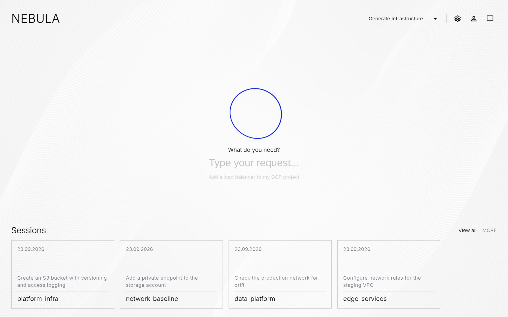

<!--
SPDX-FileCopyrightText: 2026 INDUSTRIA DE DISEÑO TEXTIL S.A. (INDITEX S.A.)

SPDX-License-Identifier: Apache-2.0
-->

# Kumoss

Kumoss turns natural-language requests into reviewed, compliant Infrastructure as Code (IaC). Platform engineers and application developers describe the infrastructure they need, and Kumoss's agents generate Terraform-compatible HCL in the right repository, guided by the organization's architecture, security, and networking standards. Every change is validated, planned, reported, and audited for compliance before Kumoss opens a pull request and applies it on request.

Kumoss is an orchestration platform: a FastAPI core, a React web application, and four replaceable sidecar services behind OpenAPI contracts for the IaC engine, repository mapping, notifications, and authorization.

## Documentation

The full documentation is published at **[inditextech.github.io/kumoss](https://inditextech.github.io/kumoss)**.

- [Quickstart](https://inditextech.github.io/kumoss/prerelease/main/quickstart/): run the full stack locally with Docker Compose.
- [Architecture](https://inditextech.github.io/kumoss/prerelease/main/architecture/): components, the core's layering, and the end-to-end flow from a request to an applied plan.

## Contributing

We welcome contributions! Please read [CONTRIBUTING.md](CONTRIBUTING.md) and follow the [Code of Conduct](CODE_OF_CONDUCT.md). Security issues are handled as described in [SECURITY.md](SECURITY.md).

## License

This project is licensed under the [Apache-2.0 License](LICENSE).

© 2026 INDUSTRIA DE DISEÑO TEXTIL S.A. (INDITEX S.A.)
