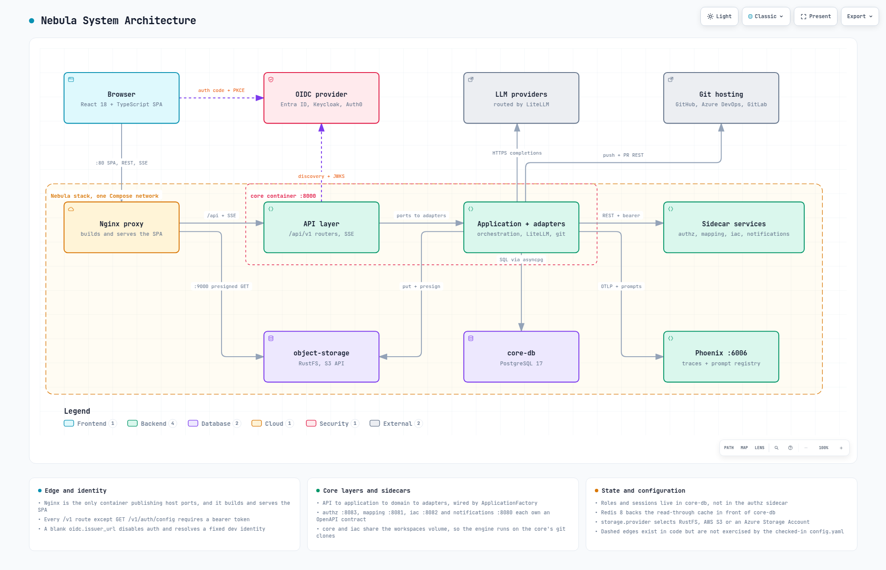
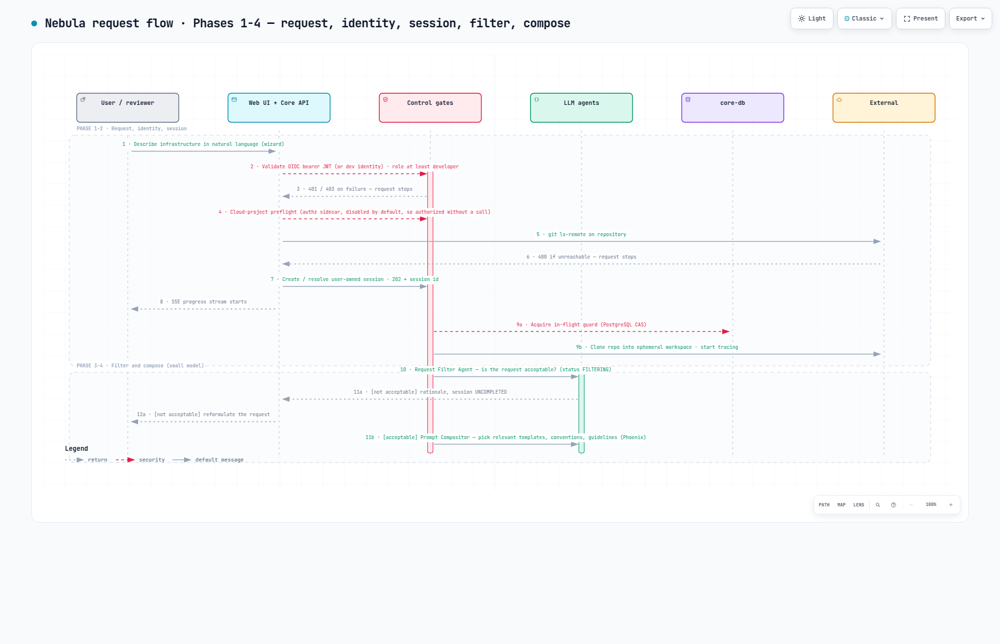
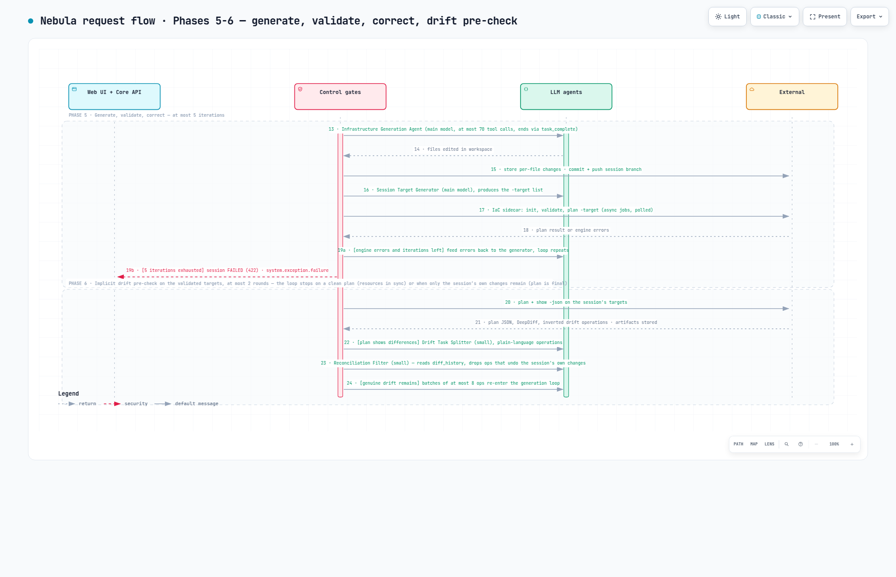
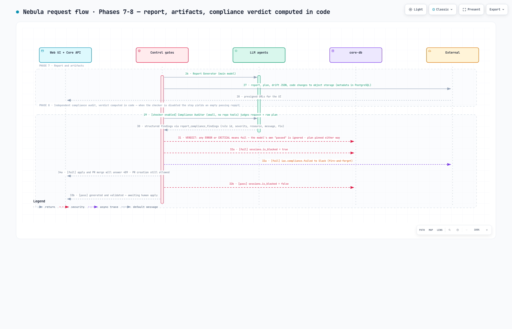
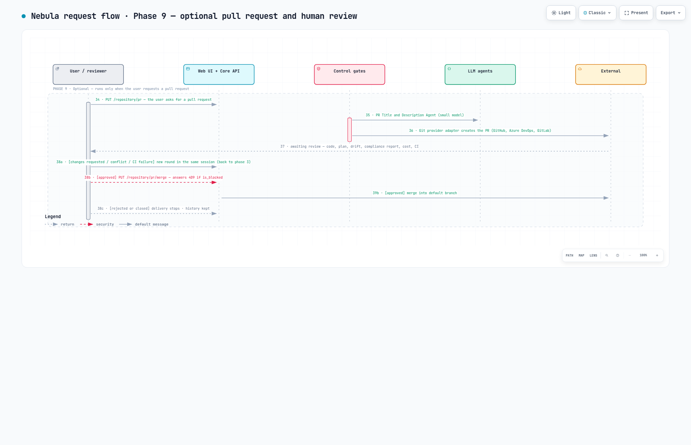
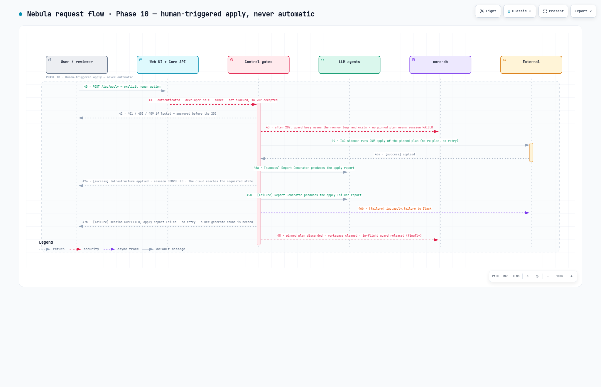
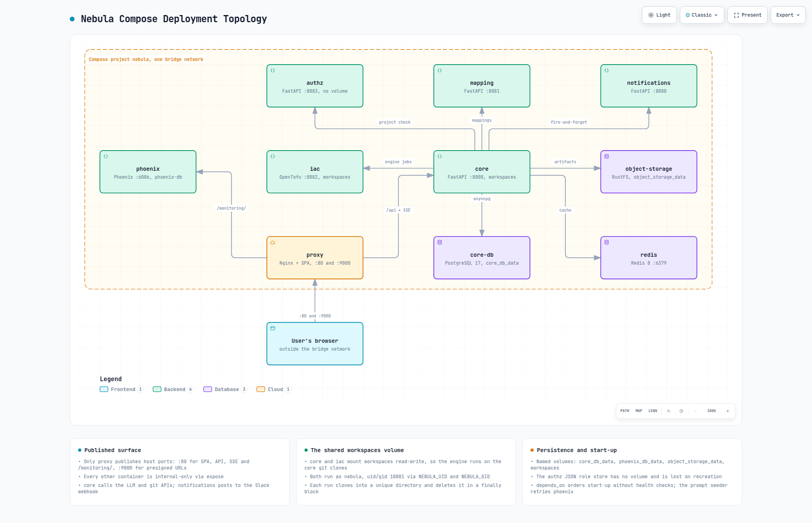

<!--
SPDX-FileCopyrightText: 2026 INDUSTRIA DE DISEÑO TEXTIL S.A. (INDITEX S.A.)

SPDX-License-Identifier: Apache-2.0
-->

# Nebula High-Level Architecture

## Purpose and Scope

Nebula is an LLM-powered platform that turns natural-language requests into compliant, Terraform-compatible infrastructure-as-code. This document describes the runtime components, the core's internal layering, the end-to-end request flow, and the persistence, telemetry, and integration boundaries, as implemented in the repository.

**At a glance**

- **Shape.** A layered FastAPI orchestration core, four contract-first FastAPI sidecars (IaC engine, mapping, notifications, authorization), and an nginx edge that serves a React single-page application and proxies the API.
- **Engines.** OpenTofu (MPL-2.0) is the bundled, verified default; HashiCorp Terraform (BUSL-1.1) is also bundled and selectable with `IAC_BINARY` (see "Choosing the IaC engine" in [services/iac/README.md](../services/iac/README.md)).
- **Default deployment.** One Docker Compose stack on one bridge network with nginx as the only public entry point. This is the local/non-production model and the reference topology for production; see [getting-started-local.md](getting-started-local.md) and [getting-started-production.md](getting-started-production.md).
- **Open source end to end**, with one disclosed exception: OpenTofu, RustFS (Apache-2.0, the default artifact store), PostgreSQL, Redis, nginx, FastAPI, React, LiteLLM, and standards-based OpenID Connect against any compliant provider. Arize Phoenix (Elastic License 2.0, source-available) provides traces and the prompt registry; see [Licensing of the default stack](#licensing-of-the-default-stack).
- **Control model.** Models propose, code decides: every state change and every blocking decision (in-flight guard, validation, compliance verdict, session lock, apply) is computed by application code, and apply is always a human action.

Related guides: [getting-started-local.md](getting-started-local.md) and [getting-started-production.md](getting-started-production.md) (the two deployment models), [configuration.md](configuration.md) (every `config.yaml` field), [environment-variables.md](environment-variables.md), [litellm.md](litellm.md), [modes.md](modes.md) (what each operating mode does), [user-guide.md](user-guide.md) (for people who use the web application), [admin-portal.md](admin-portal.md) (own sessions and the admin panel), [monitoring.md](monitoring.md) (tracing), [phoenix-prompt-templates.md](phoenix-prompt-templates.md) (the prompt registry), and [oidc-setup.md](oidc-setup.md).

## Architecture Diagram

The image is a static export. Its source of truth is the typed specification [`diagrams/system-architecture.architecture.json`](diagrams/system-architecture.architecture.json), which also generates an interactive HTML view; that export is a build output and is not checked in.

Dashed edges are wiring that exists in code but is not exercised by the checked-in `config.yaml`: the identity provider is contacted only once `oidc.issuer_url` is set.

The diagram deliberately condenses detail that the rest of this document expands:

- The four sidecars share one node (`authz :8083`, `mapping :8081`, `iac :8082`, `notifications :8080`).
- The core appears as its API layer plus a single "application and adapters" node covering the application, domain and infrastructure layers.
- Redis 8, the `workspaces` volume, `phoenix-db`, and the notification webhook and object storage backends are carried in the notes beside the diagram rather than drawn as nodes.

Phoenix is reachable through the proxy at `/monitoring/`, artifacts land in the `nebula-artifacts` bucket, and the shipped `config.yaml` routes model calls through LiteLLM.

## Component Responsibilities

| Component | Responsibility | Main relationships |
|---|---|---|
| React SPA (`client/web`) | OIDC public client (Authorization Code + PKCE via `oidc-client-ts` / `react-oidc-context`), session wizard, planning/results views, user page, admin panel; consumes REST and SSE with relative `/api` paths and a bearer token on every call | Built into the Nginx image; talks to Nginx for the API and directly to the identity provider for login |
| Nginx (`proxy`) | Sole public entry point (ports 80, 9000); serves the built SPA, proxies `/api`, a buffering-disabled SSE location, `/monitoring/`, and port 9000 to object storage | Browser → core, Phoenix, object-storage |
| Core API layer (`core/src/api/v1`) | Routers: `terraform` (generate/drift/apply, 202 + session id), `events` (SSE), `session` (caller-scoped read models), `repository` (PR create/merge, repo parse), `auth` (public OIDC config for the SPA + cloud-project authorization), `users` (`/users/me` identity and roles), `admin` (cross-user sessions, plan locks, role management), `mapping` (passthrough), `notifications` (user-originated notifications, 202 + delivery id). `core/src/api/deps.py` supplies the `get_current_user`, `require_operation_role`, `require_panel_role` and `assert_session_access` dependencies | Delegates to application handlers |
| Application layer (`core/src/application`) | `TerraformCRUDHandler`, `TerraformDriftHandler`, `TerraformApplyHandler`; the services in `application/services/`: `RequestsFilterService`, `TerraformDriftService`, `ReportService`, `PullRequestService`, `SessionOrchestrationService`; `ApplicationFactory` builds a per-session object graph | Composes domain services |
| Domain layer (`core/src/domains`) | Entities and ports (including `User` and the `TokenClaims` value object) plus every service in `domains/services/`: `LLMOrchestrationService` (agent loop), `ToolOrchestrationService`, `TemplateOrchestrationService`, `SessionService`, `UserService` (identity resolution, first-login provisioning, bootstrap-admin elevation), `TerraformValidationService`, `TerraformTargetService`, `TaskService`, `ComplianceCheckService` (post-report audit), `ArtifactStorageService`, `DatabaseService`, `IacRootDetectionService`, `TracerService` | Depends only on interfaces |
| Infrastructure layer (`core/src/infrastructure`) | Adapter packages: `auth/` (OIDC discovery + JWKS bearer-token validator built on PyJWT), `llm/` (LiteLLM Router), `filesystem/` (git CLI + provider REST, workspace lifecycle), `terraform/` (iac-sidecar driver, backend override renderer), `external/` (sidecar facades), `tools/` (agent tool registry), `templates/` (Jinja layouts), `storage/` (RustFS/S3/Azure), `database/` (async SQLAlchemy), `redis/`, `telemetry/` (OpenTelemetry/Phoenix). The generated sidecar clients are **not** part of this layer: they live in `core/src/clients`, a sibling package of `infrastructure` | Implements domain ports |
| authz service | Cloud project access checks (`POST /v1/check`); permissive reference implementation, disabled by default (the core then answers "authorized" without calling it; when enabled, an unreachable sidecar is an error, not an allow). Its user/role endpoints are no longer consumed by the core, which keeps users and roles in core-db | Called from `POST /auth/authorize` with the caller's email or subject; container-local JSON role store |
| iac service | Runs one IaC engine CLI command (OpenTofu by default, selected via `IAC_BINARY`) per async job: `init`, `validate`, `plan`, `show`, `apply`; the bundled sidecar also implements the contract's `import`, `import/state-resource-ids` and `import/scope-resource-ids` operations, but the core calls only the first five (`core/src/infrastructure/terraform/terraform.py:48-53`); 202 + job id, caller polls. The bundled implementation is a reference for non-production installs; production deployments are expected to implement the contract to their own requirements (see [getting-started-production.md](getting-started-production.md)) | Shares `workspaces` volume with core |
| mapping service | Resolves a business identifier to a repo URL, plus a best-effort terraform provider and cloud scope (`null` = unknown, ask the user); identity passthrough reference | Called via core passthrough endpoint |
| notifications service | Channel-agnostic notify contract; reference implementation posts color-coded Slack webhook messages | Invoked fire-and-forget by core on compliance-check, apply and pipeline failures; request/response from the browser-facing `POST /notifications` route (support requests from the header's chat-bubble modal) |
| OpenAPI contracts (`contracts/openapi`) | Source of truth for the four sidecar APIs; generated httpx clients in `core/src/clients`; Schemathesis conformance suites | Contracts → generated clients → sidecars |
| core-db (PostgreSQL 17) | System of record, twelve tables (`core/src/infrastructure/database/models.py:57-297`): `users`, `sessions`, `workspaces`, `terraform_providers`, `pull_requests`, `histories`, `statuses`, `rounds`, `artifacts`, `terraform_plans`, `reports`, `code_changes` | Core via asyncpg |
| Redis 8 | Fail-open read-through/write-through cache (session facts, last status, finished-session aggregates); no pub/sub, no locks | Core only |
| object-storage (RustFS, Apache-2.0) | **Default, bundled** artifact store (`nebula-artifacts`): reports, plans, drift JSON, code changes; browser access via presigned URLs. Alternatives selected by `storage.provider`: AWS S3 (`S3`), Azure Blob Storage through a storage account (`STORAGE_ACCOUNT`), or any other S3-compatible endpoint (`RUSTFS` with a custom `endpoint_url`). Also holds Terraform/OpenTofu state, in the **separate** bucket named by `storage.terraform_state_bucket` — on by default as shipped | Core (SDK) and browser (via Nginx :9000) for artifacts; iac sidecar (engine backend) for state |
| `workspaces` volume | Per-run git clones under `/workspaces/<session>/<call>`. A failed or uncompleted run's directory is removed in a `finally` block, but a successful generate round *renames* its directory to `/workspaces/<session>/pinned`, which persists on the volume until apply discards it or the next generate round replaces it | Mounted by core and iac |
| Phoenix + phoenix-db | OpenTelemetry trace collector/UI and prompt registry; prompts seeded at core boot from `core/prompts/seed` | Core via OTLP/HTTP and Prompts API |
| OIDC identity provider | Authenticates users and issues the JWT access tokens the core validates; any spec-faithful provider with discovery, JWKS and JWT access tokens (Entra ID, Keycloak, Auth0 and Okta are documented) | Browser (login) and core (discovery + JWKS); configured in `config.yaml` `oidc` |
| LLM providers | Model inference behind LiteLLM Router; main + small model roles | Selected by `llm.model` and `llm.small_model` in `config.yaml` (optional `llm.model_list` for routing); credentials in `core/.env` — see [litellm.md](litellm.md) |
| Git hosting | Clone/push via git CLI; PR create/merge via GitHub, Azure DevOps, or GitLab REST APIs. The adapters target the public SaaS hosts only (`github.com`, `gitlab.com` without subgroups, `dev.azure.com`) and require HTTPS repository URLs; GitHub Enterprise Server and self-managed GitLab are not supported today | Selected by `git.provider` |

## End-to-End Flow: From Request to Applied Infrastructure

The sequence below follows one generate session from the moment a user types a request until the reviewed plan is applied. It is split into five sequence diagrams, one per group of phases, placed against the subsections that explain them. All five draw on the same cast of participants, left to right: the **user or human reviewer**, the **Nebula web UI and core API**, the **control gates** (guards, validators, locks, the compliance verdict: code, not models), the **Nebula LLM agents** (each a prompt-driven agent loop), **core-db** (the PostgreSQL rows the gates read and write), and the **external systems** (Git hosting, the IaC engine in the iac sidecar, object storage, Slack, the cloud). Each diagram shows only the participants its own phases use. Every step that changes state or blocks progress belongs to the control gates on purpose: models propose, code decides.

Messages are numbered **1 to 49 continuously across the five diagrams**, so the numbering never restarts; the phase numbering matches the subsections below, which explain each phase with the implementation details behind the arrows. Operating modes other than generate are described in [modes.md](modes.md).

The editable sources are the Archify sequence specifications in [`diagrams/`](diagrams/) (`flow-phases-1-4`, `flow-phases-5-6`, `flow-phases-7-8`, `flow-phase-9`, `flow-phase-10`, each a `*.sequence.json`). Each renders to a self-contained interactive HTML page — not committed, it is a build output — which is exported to the PNG embedded below. The PNG is what this page shows, so changing a specification means re-exporting its PNG too.

### Phases 1 and 2: request, identity, session

*Messages 1 to 13. This diagram also covers phases 3 and 4, in the next subsection.*

- **The user describes the infrastructure** in the wizard: repository URL, target cloud, scope id, optional IaC path, and the request text. The IaC path is chosen from the Terraform roots that `POST /api/v1/repository/parse` detected from a metadata-only clone (`IacRootDetector`, a `git ls-tree` heuristic over `.tf` directories; rules in [Operating modes](modes.md#how-nebula-finds-terraform-roots)). The UI calls `POST /api/v1/iac/generate` with a bearer token.
- **Identity and role check.** The `get_current_user` dependency validates the OIDC JWT against the issuer's JWKS, or resolves the fixed local-developer identity when `oidc.issuer_url` is blank. `require_operation_role(developer)` then checks the operation role. A missing or invalid token answers `401`; an insufficient role answers `403`. Nothing else runs until this passes.
- **Cloud-project preflight.** The wizard's earlier `POST /api/v1/auth/authorize` asked the authz sidecar whether the user may work on that cloud project. With the shipped configuration the sidecar is disabled and the answer is "authorized" without any network call; it is an integration hook, not one of Nebula's own controls.
- **Repository reachability.** The core runs `git ls-remote` on the URL (which must not embed credentials). An unreachable or rejected repository answers `400` and no session is created.
- **Session creation.** A session row owned by the caller is created (or, when a `session_id` is sent, the existing session is resolved and ownership asserted), a new round is opened, and the API returns `202 Accepted` with the session id. From here on everything runs as an in-process background task.
- **Progress stream.** The UI subscribes to `GET /api/v1/events/subscribe/{session_id}`; ownership is checked once at connect time and status events are streamed every 4–5 seconds until a terminal status.
- **Guard, workspace, tracing.** The runner acquires the in-flight guard, an atomic compare-and-set on the session row (`DatabaseService.acquire_in_flight`, `core/src/domains/services/database_service.py:917-962`). The `202` has already been sent by then, so a concurrent request is never refused with `409`: the runner that loses the compare-and-set logs `runner not started: Session ... already has an operation in flight` and returns without touching the session (`core/src/api/v1/terraform.py:84-88`). It then clones the repository into `/workspaces/<session>/<call>` on the volume shared with the iac sidecar, creates and pushes the branch `Nebula/<UTC timestamp>`, and installs the per-session Phoenix tracer.

### Phases 3 and 4: filter and compose (small model)

- **Request Filter Agent** (status `filtering`). The small model, with read-only workspace tools, classifies the request against the `general-guidelines-requests` and `<cloud>-guidelines-forbidden_actions` prompts. A change request proceeds. A question is answered in the conversation, and an out-of-scope, prohibited, or ambiguous request is declined with a rationale; in both cases the round ends `uncompleted` and the user is invited to reformulate. The session itself stays usable.
- **Prompt Compositor.** Two small-model passes select, from the cloud's `resources_list` and `abbreviations` prompts in Phoenix, the resource templates and abbreviations relevant to the request, then look for dependencies among the selected templates. The result, the round's *conventions*, is what every later agent is rendered with (see [phoenix-prompt-templates.md](phoenix-prompt-templates.md)).

### Phase 5: generate, validate, correct (at most 5 iterations)

*Messages 14 to 25. This diagram also covers phase 6, in the next subsection.*

- **Infrastructure Generation Agent** (status `generating`). The main model edits Terraform files in the workspace through the tool registry (read, write, list, ripgrep search, web search), bounded by `orchestration.max_tool_chain_executions` (70) tool calls and terminated by the sentinel `task_complete` tool.
- **Persist and push.** Every changed or new file is uploaded as a code-change artifact and committed and pushed to the session branch, so the work is durable before validation starts.
- **Session Target Generator.** The main model derives the `-target` list for this round from the branch's diff history, so the plan covers what the round changed rather than the whole root module.
- **Validation** (status `validating`). The core submits `init` (cached: run once per `Terraform` instance, so once per round, and re-run only when the engine's own output asks for `terraform init` — `core/src/infrastructure/terraform/terraform.py:245-302`), `validate`, and `plan -out session.plan -target ...` as asynchronous jobs to the iac sidecar, polling each every `services.iac.job_poll_interval` seconds within `services.iac.job_timeout`. The engine (OpenTofu by default) runs against the shared workspace with the cloud credentials of `services/iac/.env`.
- **Correct or fail.** Engine errors are fed back to the generation agent as the next query, and generation through validation repeats. After `orchestration.max_validation_iteration` (5) failures `generate_and_validate` raises `ValidationLoopExceededError` (`422`, `core/src/domains/services/terraform_validation_service.py:159-162`); the runner catches it, marks the session `FAILED` with `runner failed: Validation loop exceeded.` and fires a `system.exception.failure` notification (`core/src/api/v1/terraform.py:112-118`). No LLM problem summary is produced — the `summarize_problem` path in `terraform_crud_handler.py` is unreachable. The branch keeps the last pushed attempt, and because `FAILED` is terminal for the **session**, not just the round, that session can never be resumed: `acquire_in_flight` refuses any session whose latest status is `FAILED` (`database_service.py:105-108,952-958`). Only a new session can carry the work forward.

### Phase 6: implicit drift pre-check on the validated targets (at most 2 rounds)

- **Inspect the plan.** With the code validated, the core runs `show -json` on the plan artifact validation left in the workspace and diffs each resource's `before` and `after` states. It reads the round's own plan instead of producing a second one: the validation step handed back a `PlanRef` naming that artifact, and the pre-check passes the ref straight to `show`. The differences are inverted into "make the code match the infrastructure" operations, and the drift JSON is stored as an artifact.
- **Split and filter.** If the plan shows differences, the Drift Task Splitter (small model) turns them into plain-language operations, and the Reconciliation Filter (small model) reads the branch's `diff_history` and drops every operation that would merely undo the session's own intended changes.
- **Decide.** If genuine drift remains, it re-enters the generation loop in batches of `orchestration.drift_group_operations` (8) with the forbidden-actions block omitted, and the pre-check runs once more — on the ref the last reconciliation round produced, again without planning twice. If only the session's own changes remain, or the plan is clean, the pre-check stops and the last plan is final.

### Phase 7: report and artifacts

*Messages 26 to 34. This diagram also covers phase 8, in the next subsection.*

- **Report Generator** (status `report`). The main model turns the final plan into a JSON report: create, update, delete, and recreate counts, detailed changes, an impact banner (`low`, `medium`, `high`) assigned with the `general-compliance-impact` criteria, and cost estimates.
- **Artifacts.** Report, plans, drift JSON, and code changes are stored in object storage under `sessions/<session>/rounds/<round>/`, where `<round>` is the round's **database primary key**, not its ordinal in the session. The three key patterns are `reports/<report type>-<token>.json`, `plans/{plan|drift}-<token>.txt`, and `changes/<token>-<sanitized file name>` (`core/src/domains/services/artifact_storage_service.py:73-76,113-116,153-156`). Metadata is written to PostgreSQL, and the UI receives presigned URLs signed against the public port-9000 endpoint.

### Phase 8: independent compliance audit, verdict computed in code

- **Compliance Auditor** (when `orchestration.enable_compliance_checker` is `true`). A second, independent small-model agent receives the session's first request and the raw plan output (not the report JSON) together with the `general-compliance-report` rules and the cloud guidelines. It has no repository tools; its only tool is the sentinel `report_compliance_findings`, through which it must answer with structured findings: rule id, severity, resource, message, suggested fix. When the checker is disabled the step yields an empty passing report.
- **Verdict in code.** The tool handler recomputes `passed` from the severities: any `error` or `critical` finding fails the audit regardless of the model's own claim. The plan is **pinned** either way: the validated workspace with `session.plan` is kept as the session's pinned plan, replacing any earlier pin.
- **Lock or release.** The handler writes `is_blocked = (audit failed) or (impact is high and orchestration.block_on_high_impact)`. On failure, a fire-and-forget `iac.compliance.failed` notification or `iac.impact.high` notification goes to the notifications sidecar, and the UI shows that apply and pull-request merge will answer `409` while pull-request creation stays allowed. On pass the lock is cleared and the round completes: generated and validated, awaiting a human decision. A panel `editor` can toggle the lock from the admin panel ([admin-portal.md](admin-portal.md)).

### Phase 9: optional pull request and human review

*Messages 35 to 40.*

- **Pull request on demand.** `PUT /api/v1/repository/pr` (owner, `developer`) has the PR Title and Description Agent (small model) draft the text, then the Git provider adapter (GitHub, Azure DevOps, or GitLab REST API) opens the pull request from the session branch. Reviewers see the code, the plan, the drift and compliance reports, the cost estimate, and their own CI.
- **Review outcomes.** Requested changes become a new request in the same session (back to phase 3, a new round on the same branch) — possible while the session is `COMPLETED` or `UNCOMPLETED`, never after a `FAILED` round, which closes the session for good. Approval leads to `PUT /api/v1/repository/pr/merge`, which merges into the default branch unless the session is locked (`409`). A rejected or closed pull request simply ends delivery; the session history and artifacts are kept.

### Phase 10: human-triggered apply (never automatic)

*Messages 41 to 49.*

- **Explicit human action.** `POST /api/v1/iac/apply` with the session id. Nothing in the pipeline applies on its own; in the UI this is the "Approve PR and Apply" button after a merge or the Import Infrastructure mode on an existing session.
- **Gates.** Before answering, the route requires a valid identity, the `developer` role, session ownership, and a session that is not locked (`409 Session ... is blocked`); it then answers `202`. That `409` is the only one a client sees. In the background the runner needs a free in-flight guard (otherwise it logs and exits without changing the session), and the handler needs a pinned plan: without one it raises `No reviewed plan is pinned for this session; run a generate round before applying.`, so the runner marks the session `FAILED`, sends `system.exception.failure`, and the session — being `FAILED` — can no longer be resumed. A drift-only session is exactly that case, because drift rounds never pin.
- **One apply.** The iac sidecar runs a single `apply session.plan` on the pinned workspace: no re-plan, no retry. Exactly the reviewed plan executes.
- **Outcome.** On success the Report Generator writes an `apply` report and the session completes; the cloud is in the requested state. A non-zero exit from the engine is **not** an exception: `Terraform.apply()` returns a `TerraformApplyDTO` with `ok=False` (`core/src/infrastructure/terraform/terraform.py`), the handler still writes an `apply` report, sends the `iac.apply.failure` notification and returns normally (`core/src/application/use_cases/terraform_apply_handler.py:73-86`), so the runner marks the session `COMPLETED` — the session completes with an apply report whose status is `Failed`. There is no retry; a new generate round is needed to produce a new plan.
- **Cleanup** (always). The pinned plan is discarded, the run directory is removed from the volume, and the in-flight guard is released in a `finally` block.

### Reading the diagrams: legend

Each diagram is an Archify sequence diagram: participants across the top, time running downwards, one arrow per message. Its conventions:

**Participants** (the boxes at the top; each diagram shows only the ones its phases use)

| Participant | Meaning |
|---|---|
| **User / reviewer** (grey) | Human actor. Only a human starts a request, creates or merges a pull request, or applies. |
| **Web UI + Core API** (blue) | The React application and the FastAPI routers: authentication dependency, `202` answers, SSE stream, presigned URLs. |
| **Control gates** (red) | Application code with no model judgment: session and lock handling, the in-flight guard, git operations, drift calculation, the compliance verdict, artifact storage. Every state change and every blocking decision happens here. |
| **LLM agents** (green) | Prompt-driven agent loops. Each message into this participant names the agent and its model role (`main` = `llm.model`, `small` = `llm.small_model`); see the [agent catalogue](#agent-catalogue). |
| **core-db** (purple) | The PostgreSQL rows the gates read and write: the session, its status, the in-flight guard, `is_blocked`, artifact metadata. Drawn as its own participant so that every state change is a visible message rather than an invisible side effect. |
| **External** (amber) | Systems outside the core: Git hosting, the IaC engine in the iac sidecar, object storage, Slack through the notifications sidecar, and the cloud platform. |

**Arrows and bands**

| Element | Meaning |
|---|---|
| Solid grey arrow (`default message`) | A call or hand-over in the direction of the arrow: a request, a command submitted, files handed to the next step. |
| Dashed grey arrow (`return`) | A result or answer flowing back: engine output, structured findings, an HTTP status, a message shown to the user. |
| Dashed crimson arrow (`security`) | A gate or a state change with authority over the flow: identity and role checks, refusals, the compliance verdict, the lock flag, the in-flight guard, cleanup. |
| Dashed purple arrow (`async trace`) | A **fire-and-forget** notification to the notifications sidecar. It never fails the pipeline. |
| Vertical bar on a participant's lifeline | An activation: that participant is busy for the span the bar covers. |
| Dashed band labelled `PHASE n · …` | One phase of the flow; the numbering matches the subsections above. The band label also carries the facts that have no arrow of their own, such as the conditions under which a bounded loop stops. |
| Message numbers | Numbered **1 to 49 continuously across the five diagrams**. They do not correspond one-to-one with the bulleted steps in the subsections above, which group several messages per step. |
| A number with an `a` / `b` / `c` suffix | **Mutually exclusive** arms of the same decision: `32a` and `32b` are the two outcomes of the compliance verdict, and only one of them happens. Each arm's messages also start with its condition in square brackets, for example `[fail]`, `[pass]`, `[approved]`. Because a sequence diagram draws messages in one column, the arms of a branch appear one after another; the shared number and the bracketed condition are what mark them as alternatives rather than consecutive steps. Arms can differ in length, so a number may carry only one suffix: `13a` with no `13b` means only the first arm still has a message at that point. |
| `[at most n …]` in a label or band | A bounded loop with its configured ceiling: 70 tool calls per generation agent, 5 validation iterations, 2 drift pre-check rounds, 8 operations per drift batch. |

### Agent catalogue

Every message into the agents lane is one of the agents below. Each is an `LLMOrchestrationService` loop rendered from a Jinja layout with prompts fetched from Phoenix, given a fixed tool set, and ended by a **sentinel tool** whose structured arguments are the agent's result. Model routing is by prompt type: only the generation, target, and report prompts use the main model.

| Agent | Model role | Tools available | Ends via | Where it appears |
|---|---|---|---|---|
| Infrastructure Generation Agent | main | `write_to_file`, `replace_in_file`, `delete_file`, `read_file`, `list_dir`, `bulk_grep_search`, `diff_history`, `web_search` | `task_complete` | Phase 5; re-entered by drift batches in Phase 6 and by dedicated drift sessions |
| Session Target Generator | main | `read_file`, `list_dir`, `bulk_grep_search`, `diff_history` (read-only) | `generate_terraform_targets` | Phase 5, before every `plan -target` |
| Drift Target Generator | main | the same read-only set, rendered with the `general-guidelines-targeting_policies` prompt | `generate_terraform_targets` | Dedicated **partial** drift sessions only, never in the generate flow |
| Report Generator | main | plan and apply reports: `web_search`. Drift report: `read_file`, `list_dir`, `bulk_grep_search`, `diff_history` (it **must** call `diff_history`) and no web search | `generate_terraform_plan_report`, `generate_terraform_drift_report`, or `generate_terraform_apply_report` | Phase 7 (generate report), Phase 10 (apply report), dedicated drift sessions (drift report) |
| Request Filter Agent | small | `read_file`, `list_dir`, `bulk_grep_search`, `diff_history` | `requests_filter` | Phase 3; also the first step of partial drift sessions |
| Prompt Compositor | small | none besides its sentinel | `construct_information` (called in two passes) | Phase 4 |
| Status Message Agent | small | none | plain text | Every status change; its text is what the SSE stream carries |
| Drift Task Splitter | small | `read_file`, `list_dir`, `bulk_grep_search`, `diff_history`, `web_search` | `report_decomposed_task_operations` | Phase 6 and dedicated drift sessions |
| Reconciliation Filter Agent | small | `read_file`, `list_dir`, `bulk_grep_search`, `diff_history` (it **must** call `diff_history`) | `report_decomposed_task_operations` | Phase 6 only (generate rounds) |
| Drift Exception Filter Agent | small | none besides its sentinel; rendered with the cloud's `drift_exceptions` prompt | `report_decomposed_task_operations` | Phase 6 and dedicated drift sessions, after the reconciliation filter |
| Compliance Auditor Agent | small | none besides its sentinel (input: the first request and the raw plan output) | `report_compliance_findings` | Phase 8, generate rounds only, when `orchestration.enable_compliance_checker` is `true` |
| PR Title & Description Agent | small | none | `generate_pull_request` | Phase 9 |

**Deterministic (non-LLM) components** that appear in the other lanes: the FastAPI routers and use-case handlers; PostgreSQL session, ownership, status, `in_flight`, and `is_blocked` controls; the git workspace service and the GitHub, Azure DevOps, and GitLab provider adapters; the iac sidecar (OpenTofu or Terraform command executor); drift calculation (`plan_to_drift`, DeepDiff); the code-computed compliance verdict; object storage with presigned URLs; SSE status delivery; the notifications sidecar.

Nebula orchestrates these specialised agents through application code. Agents do not delegate to one another and there is no supervisor agent: the handler classes call each agent in a fixed order, and every loop has a configured ceiling (`orchestration.max_tool_chain_executions`, `max_validation_iteration`, `max_drift_reports`, `drift_group_operations`; the drift pre-check inside a generate round is fixed at two iterations).

### Terminal states

Where a generate session can end, what the database records, and which phase diagram shows it. In the last column 🟩 is a successful end state, 🟥 a rejection, block, or failure, 🟨 a state waiting on a human review, and 🟧 a state waiting on the human to reformulate, or a bounded loop that stopped without converging.

| End state | Reached when | Session status and side effects | In the diagram |
|---|---|---|---|
| Infrastructure applied | The human-triggered apply succeeded | `COMPLETED` (apply round); pinned plan discarded | 🟩 Phase 10 |
| Generated and validated, awaiting human apply | The generate round passed the audit (or the checker is disabled) and the impact is not `high` | `COMPLETED`, `is_blocked = false`, plan pinned | 🟩 Phase 8 |
| Awaiting pull-request review | The user created a pull request | `COMPLETED` (unchanged); pull request recorded | 🟨 Phase 9 |
| Changes requested | The reviewer asked for changes, or CI or a conflict failed the pull request | A new round of the same session starts at Phase 3 | amber loop, Phase 9 |
| Request declined or answered | The Request Filter Agent declined the request or answered a question | `UNCOMPLETED`; the session stays usable | 🟧 Phase 3 |
| Apply locked | Any `error` or `critical` compliance finding, or a `high` impact banner with `orchestration.block_on_high_impact` | `COMPLETED`, `is_blocked = true`, plan pinned; `iac.compliance.failed` or `iac.impact.high` notification | 🟥 Phase 8 |
| Validation failed after the maximum iterations | `orchestration.max_validation_iteration` (5) generate-and-validate attempts exhausted | `FAILED` with `runner failed: Validation loop exceeded.`; `system.exception.failure` notification; no LLM problem summary; the branch keeps the last pushed attempt | 🟥 Phase 5 |
| Drift pre-check did not converge | Two pre-check iterations used and drift remains | The drift is re-read from the plan the last remediation batch produced, so the report and the pinned `session.plan` describe the same plan; the round continues to the report with that drift and a warning is logged. If a remediation batch itself exhausts its five validation iterations, the round ends `FAILED` instead (`core/src/application/services/terraform_drift_service.py`) | 🟧 Phase 6 |
| Pull request rejected or closed | The reviewer closed the pull request | Session status unchanged; history and artifacts kept | 🟥 Phase 9 |
| Apply failed | The engine's apply returned a non-zero exit code | `COMPLETED`, with an `apply` report whose status is `Failed`; `iac.apply.failure` notification; pinned plan discarded; no automatic retry, a new generate round is needed | 🟥 Phase 10 |
| Apply requested without a pinned plan | Apply on a session whose last round was drift-only, or whose pinned plan was already consumed | `202` answered, then the session ends `FAILED` with `No reviewed plan is pinned for this session; run a generate round before applying.` and a `system.exception.failure` notification; the session cannot be resumed | 🟥 Phase 10 |
| Pipeline failed | An LLM or tool error, a sidecar timeout, a git or storage failure, or any other handled exception | `FAILED`; `system.exception.failure` notification; workspace cleaned; in-flight guard released | 🟥 reachable from any phase |
| Run stopped without a status | A prompt missing in Phoenix for the deployment's `environment` tag (an unhandled `Prompt not found`) | Last status kept, no failure message, guard released; see [phoenix-prompt-templates.md](phoenix-prompt-templates.md#runtime-lookup) | not shown |

`FAILED` is terminal for the **session**, not only for the round: `acquire_in_flight` refuses to start a run on a session whose latest status is `FAILED` (`core/src/domains/services/database_service.py:105-108,952-958`), so no follow-up request, apply, or drift round can be attached to it. `COMPLETED` and `UNCOMPLETED` sessions accept new rounds normally.

## How the Architecture Works

This section explains the mechanisms behind the flow above, one concern per subsection.

### Browser delivery and ingress

- The nginx image compiles the SPA in a Node builder stage and serves the static bundle itself; there is no separate frontend container.
- The SPA uses relative paths, so nginx is the only address the browser knows: `/api` proxies to `core:8000`, a dedicated `location /api/v1/events/subscribe/` disables proxy buffering so Server-Sent Events (SSE) stream immediately, and `/monitoring/` exposes the Phoenix UI.
- nginx performs no authentication. Bearer tokens pass through to the core; the SSE location is treated like the rest of `/api`.

### Authentication

**Bootstrap.** Before rendering, the SPA (`main.tsx`) fetches the only unauthenticated route, `GET /api/v1/auth/config`, which returns the OIDC `issuer_url`, `client_id`, optional `audience`, and the resolved `scope` from `config.yaml`.

**Auth disabled** (blank `issuer_url`, the checked-in default). The SPA mounts a dev provider that just calls `/users/me`; the core resolves every request to a fixed local-developer identity (`urn:nebula:dev` / `dev`), provisioned as a real `users` row with the top role of both groups.

**Auth enabled.** The SPA runs the OpenID Connect Authorization Code flow with PKCE as a public client (no client secret exists anywhere):

- login redirects to the IdP and returns to `/auth/callback`; tokens are kept by `oidc-client-ts` in `sessionStorage`; renewal is silent; logout is RP-initiated, falling back to a local sign-out when the IdP has no `end_session_endpoint`;
- every `apiFetch` call and the SSE `fetch` attach `Authorization: Bearer <access_token>`; any `401` fires a window event that flips the UI to a "session expired" login screen.

**On the core**, `get_current_user` (`core/src/api/deps.py`) is a dependency on every protected route. It validates the JWT signature against the issuer's JWKS (discovery fetched lazily on first use and cached by PyJWT's `PyJWKClient`, so boot never depends on the IdP), checks `iss` (with or without trailing slash), `aud` (`oidc.audience`, or `client_id` and `api://<client_id>` when blank), `exp`/`nbf` with `clock_skew_seconds` leeway, requires `exp`, `iss`, and `sub`, and accepts only asymmetric algorithms (RS*, ES*, PS*). `UserService` resolves the claims to a user keyed by `(issuer, subject)`: the first request provisions the row, later requests sync e-mail and display name, and a token whose `email` matches `admin.default_root_email` with `email_verified: true` is elevated one-way to `devops` + `admin` (so a newly configured root e-mail takes effect on the user's next request). Per-IdP steps are in [oidc-setup.md](oidc-setup.md).

### Authorization and ownership

Two independent role groups live on the `users` row:

| Group | Values | Gates |
|---|---|---|
| Operation role | `developer` < `devops` | `generate`, `apply`, repository parse, and pull-request routes need `developer`; `drift` needs `devops`. The SPA mirrors this in the mode drop-down, offering drift, partial drift, and import only to `devops` users even though the backend accepts `apply` from a `developer`. |
| Panel role | `viewer` < `editor` < `admin`, nullable | `viewer` lists cross-user sessions, `editor` toggles a session's plan lock, `admin` lists users and assigns roles. An admin cannot drop their own `admin` panel role (`409`). |

Sessions carry a `user_id` owner. The sessions list is always scoped to the caller; `assert_session_access` makes writes (iterations, apply, pull requests) owner-only and allows reads (detail, SSE) to the owner or to anyone with a panel role.

Separately from roles, the wizard's preflight `POST /api/v1/auth/authorize` asks the authz sidecar whether the caller may touch a given cloud project and environment. While the sidecar is disabled (the default) the core answers "authorized" without any call; once enabled, a timeout or unreachable sidecar is returned to the wizard as `504`/`502`, not as an allow. This is a hook for enterprise cloud-access policy, not the access control for Nebula's own data.

### Session creation and orchestration

- `POST /api/v1/iac/{generate|drift|apply}` creates or resolves a session row owned by the caller and returns `202 Accepted` with the session id. The `git ls-remote` reachability check is not run on every call: it applies only to requests that actually carry a `repo_uri`, which means the **first** call of a `generate` or `drift` session (`core/src/api/v1/terraform.py:59-64`). Iteration calls send only a session id and the new text, and `ApplyRequest` has no `repo_uri` field at all (`core/src/application/iac_requests.py:36-64,152-153`), so both skip it.
- The pipeline runs in-process as a FastAPI background task; there is no external job queue. The runner first acquires the in-flight guard, an atomic PostgreSQL compare-and-set; if the session is already running or finished, it logs and exits.
- For each run, `ApplicationFactory` assembles a fresh object graph around a `SessionContext`: an `LLMOrchestrationService` with two LiteLLM-backed providers (`model` and `small_model`), a `ToolOrchestrationService` with the workspace tool registry (file edits, directory listing, ripgrep search, web search), template services that fetch prompts from Phoenix, and the validation, filter, report, drift, task-splitting, and pull-request services. The repository is cloned into the shared `/workspaces` volume.

### The LLM-assisted pipeline

The generate flow advances through the statuses the SSE stream reports:

1. **FILTERING.** The small model screens the request against the request and forbidden-action prompts and can end the round as `UNCOMPLETED`.
2. **GENERATING / VALIDATING**, up to five iterations. The main model edits Terraform files through tools (at most 70 executions, terminated by the sentinel `task_complete`); files are committed and pushed; the session target generator derives `-target` entries from the history; the iac sidecar runs `init` (cached per round, re-run only if the engine asks for it), `validate`, and `plan -target`.
3. **Drift pre-check** on the validated targets (next subsection), then **REPORT**, the compliance gate, and the pin.

Model routing is by prompt type: generation, target calculation, and report writing use the main model; filtering, status messages, pull-request text, task splitting, the reconciliation filter, and the compliance audit use the small model.

### IaC and mapping sidecars

The **iac sidecar** is a deliberately thin executor, shipped as a reference for non-production installation and meant to be re-implemented against the organization's own execution platform in production. Each POST enqueues exactly one engine command (OpenTofu by default) as an asynchronous job and returns a job id; the core polls it (5-second interval, 1-hour budget per job) and does all the sequencing itself:

- **Three verbs over the plan artifact.** `plan` runs `init → validate → plan -out` and returns a `PlanRef` naming what it wrote, `drift` runs `show -json` on such a ref, and `apply` runs the artifact already in the workspace.
- **`init` is cached** per `Terraform` instance, so the retry loops that plan the same workspace repeatedly initialize it once. Both containers read the same `workspaces` volume.
- **`init` always runs `-reconfigure`**, because the engine runs with `-input=false` and could not answer a "Backend configuration changed" prompt. The consequence is that a changed backend is adopted, never migrated.
- **The sidecar owns no backend decision of its own** beyond the optional `IAC_BACKEND_CONFIG` file. The backend the engine uses is whatever the workspace contains: the `backend_override.tf` the core writes by default, since Nebula-managed state is on as shipped, or the repository's own block if that is turned off (see [Terraform/OpenTofu state backends](terraform-state-backends.md)).

The **mapping sidecar** translates a business identifier into a repository reference; the reference implementation is an identity passthrough. It may also answer with the terraform provider and cloud scope that identifier deploys to, and those answers are best effort: `null` means "unknown, ask the user", never "there is none". The wizard skips the step for every field the mapper fills, so a guess is a question the user never gets to correct — an implementation that does not know must say `null`.

### Drift detection and remediation

All drift work runs through `TerraformDriftService.detect_and_resolve_drift`, a bounded loop:

1. Read the drift out of a plan. Detection is `show -json` on a plan artifact, so the loop takes the plan to start from as a parameter: a `PlanRef` — the workspace, the plan file, the targets the plan was produced with, and a `sha256` of `git status --porcelain=v2 --branch` sampled immediately after the plan job returned. A generate round passes the ref it has just validated and its pre-check costs one `show`; a dedicated drift session passes `None` and the loop plans first. The fingerprint is what makes reading someone else's plan safe: `Terraform.drift` re-plans any ref the working tree has moved past and refuses one naming another workspace, and because it covers uncommitted and untracked files it moves for generated code, while ignoring the engine's own output (a rewritten plan file, a growing provider cache). Every reconciliation group re-plans, and the last of those is what the next iteration reads; an iteration whose split yielded no operations has no ref to hand on, so the next one plans for itself — which is what keeps every iteration that could have changed reading live state.
2. `TerraformUtils.plan_to_drift` DeepDiffs each resource's `before` and `after` and *inverts* the result into "make the code match the infrastructure" operations; the drift JSON is stored as an artifact. The plan text is stored by the validation loop that produced it, one artifact per attempt.
3. If the plan is clean, stop. Otherwise the Drift Task Splitter (small model) turns the JSON into plain-language operations, chunked into groups of `drift_group_operations` (8), and each group re-enters the generation and validation loop with the forbidden-actions block omitted (the intent is reconciliation).

The loop has two entry points that differ in *what* they target and *whether session intent is filtered out*:

| Entry point | Targets | Iterations | Filtering | Outcome |
|---|---|---|---|---|
| **Pre-check inside every generate round** | The session's own validated targets | At most 2 | Yes. The Reconciliation Filter agent (small model) must call `diff_history` (the branch's committed diff against the default branch plus untracked files) and drops every operation that would merely revert a session change, trims mixed operations to their genuine-drift part, and keeps the rest. An empty survivor list ends the loop without invoking the generator. | The GENERATE report is written from the pre-check's final plan. The handler passes the `PlanRef` from its validation loop, so the first detection adds no `plan` of its own. |
| **Dedicated drift session** (`POST /iac/drift`) | Full: the whole root module (empty target list). Partial: targets chosen by the Drift Target Generator (main model, `target_drift_generator.jinja` rendered with the `targeting_policies` guideline) after the request filter. | Up to `max_drift_reports` (3) | No; a drift session has no intended changes of its own. | A DRIFT report, written from the branch diff (see below). The handler passes `plan=None`: nothing has planned this workspace yet, so the first iteration plans for itself. The drift handler never touches the session lock, does not run the compliance audit (removed in `4eebf61`), and does not pin the workspace, so an apply after a drift-only round ends `failed` until a generate round pins a plan. |

**How the DRIFT report is written.** The drift report is the one report the generator does not receive as a text to summarise: it reads the branch for itself. `ReportService` gives `ReportType.DRIFT` the workspace-inspection tool set instead of `web_search` (`core/src/application/services/report_service.py`), and the drift branch of `report_generator.jinja` makes `diff_history` a required first call and the sole source of truth for the remediation. That works because every reconciliation group commits and pushes inside the validation loop before the report runs, so the branch's committed diff against the default branch, plus untracked files, *is* the reconciliation. No remediated resource may be named that the diff does not show. The handler (`core/src/application/use_cases/terraform_drift_handler.py`) therefore stops serialising the session history into the report query and passes only what the remediation left out, in two labelled blocks that map one-to-one onto optional report fields:

| Block in the report query | Report field | When it appears | Effect on `status` |
|---|---|---|---|
| "Unreconciled drift" | `unreconciled_drift` | The loop ended `in_sync=False`: either genuine drift the iteration ceiling left behind (`drift`) or a drift read that failed outright (`feedback`) | `Partial`, or `Failed` when nothing was remediated at all |
| "Whitelisted exceptions" | `whitelisted_exceptions` | The Drift Exception Filter excluded operations; one entry per excluded change, with the rule that covers it | **None.** Leaving them alone is the intended outcome, so the round can still report `Succeeded` |

Both blocks stay out of the schema's top-level `required`, and `resource_address` is optional inside them — a failed drift read names no resource, and a rule may cover a type or a naming pattern rather than an address — so a thin answer cannot fail DTO validation and cost an otherwise good report. One consequence of reading the branch rather than a per-round record: the diff is branch-wide, so in a multi-round drift session every report describes every change on the branch, including the ones earlier rounds made.

History note: the pre-check replaced an earlier design in which a *predictive* target agent guessed the affected resources and remediated drift *before* any code was generated. That agent, its `PREDICTIVE` mode, and its template were removed in commit `efe575a`, and the shared Phoenix guideline was renamed from `predictive_targets` to `targeting_policies`.

### Apply, reporting, and pull requests

- The apply handler runs the engine's `apply` through the sidecar. A non-zero exit is reported as a `TerraformApplyDTO` with `ok=False`, not raised: the handler writes the `apply` report, sends an `iac.apply.failure` notification, and returns normally, so the runner marks the session `COMPLETED` with an apply report whose status is `Failed`. There is no automatic retry or remediation cycle; a new generate round is needed to produce a new plan. Apply on a session with no pinned plan is the one path that does raise (`409`), which the runner turns into a `FAILED`, unresumable session.
- Every successful flow ends with an LLM-written report stored as an artifact.
- Pull requests are created on demand (`PUT /repository/pr`): the small model drafts title and description, then a provider adapter (GitHub, Azure DevOps, or GitLab) calls the hosting REST API. Merge is a separate endpoint and is refused while the session is locked.

### Compliance gate

**Where it runs.** Only in the generate handler, after the report is written and behind `orchestration.enable_compliance_checker` (`true` in the checked-in `config.yaml`; the Pydantic default is `false`). The drift handler dropped it in `4eebf61`; the apply handler has the service injected but never calls it. When disabled, the check short-circuits to an empty passing report. The gate has no SSE status of its own.

**How it audits.** `ComplianceCheckService` runs a second, independent agent loop on the small model. The auditor receives the session's first user request and the raw plan output as its query, rendered into the local `compliance_checker` layout together with the `general-compliance-report` rules and the cloud guidelines fetched from Phoenix. It has no repository access and no tool other than the sentinel `report_compliance_findings`, whose JSON-schema arguments (`rule_id`, `severity`, `resource`, `message`, `suggested_fix` per violation) are parsed into a typed `ComplianceCheckReport`. The rules themselves are applied by the model; only the verdict below is computed in code.

**Verdict in code.** The tool handler recomputes `passed` from the reported severities: any `error` or `critical` violation fails the check regardless of the model's own claim.

**Effect.** On every generate round the handler writes `is_blocked = (audit failed) or (high impact)`, where high impact means `orchestration.block_on_high_impact` is on and the report's banner is `high`. A failure sends `iac.compliance.failed` (or `iac.impact.high`) to the notifications sidecar. `POST /iac/apply` and pull-request merge refuse blocked sessions with `409`; pull-request creation is not lock-checked, and the audited code is already pushed to the working branch, so the lock guards the apply boundary specifically. A later generate round that passes with a non-high impact clears the lock; drift rounds leave it untouched; a panel `editor` can toggle it from the admin panel ([admin-portal.md](admin-portal.md)).

### Progress and persistence

- Status rows are appended to PostgreSQL with a Redis write-through; there is no message broker.
- The SSE endpoint polls the last status every 4–5 seconds (usually served from Redis) and streams small JSON events until a terminal status.
- The SPA consumes the stream with `fetch` plus `ReadableStream` (not `EventSource`, which cannot send an `Authorization` header), retrying up to three times with exponential backoff; a `401` is not retried and surfaces as a session-expired event. Token and ownership are checked once, at connect time.

### Artifacts and telemetry

- Reports, plans, drift JSON, and per-file code changes go to the `nebula-artifacts` bucket; metadata lands in PostgreSQL. The browser fetches them through presigned URLs signed against the public port-9000 endpoint that nginx forwards to RustFS.
- Every run installs a per-session tracer exporting OpenInference-annotated spans (LLM, tool, chain, Terraform) to Phoenix over OTLP/HTTP.
- Prompt templates live in Phoenix as a runtime registry, seeded at boot from `core/prompts/seed` and fetched per request by environment tag, so prompt edits apply without redeploys.
- Notifications go through a thin static facade (`NotificationServiceClient`) over the generated client. They are fire-and-forget: the facade no-ops when the sidecar is disabled and logs every send failure instead of failing the pipeline.

## Licensing of the Default Stack

Every component that runs by default in the checked-in Compose stack is open source, with one source-available exception that is disclosed rather than hidden (the bundled but inactive Terraform binary is a second, opt-in exception). Identity has no licensing footprint at all: Nebula speaks standard OpenID Connect and trusts any spec-faithful issuer, so a fully open-source deployment can pair it with Keycloak (Apache-2.0, CNCF Incubating) while an enterprise can point it at Entra ID, Auth0 or Okta without changing a line of code.

| Component | Role | Licence | Notes |
|---|---|---|---|
| Nebula (core, sidecars, SPA, contracts) | The platform | Apache-2.0 | REUSE-compliant SPDX headers |
| OpenTofu 1.12.6 | Default IaC engine in the iac sidecar | MPL-2.0 (Linux Foundation) | Digest-pinned. The same image also bundles HashiCorp Terraform 1.16.0 (BUSL-1.1, not OSI), downloaded and checksum-verified at build time and selectable via `IAC_BINARY=terraform`; running it makes your use subject to its licence terms |
| RustFS | Default, bundled S3-compatible object storage for artifacts (and for Terraform state where that is enabled) | Apache-2.0 | Rust implementation of the S3 API; AWS S3 or Azure Blob Storage selectable via `storage.provider`, or any other S3-compatible endpoint via the `RUSTFS` provider |
| PostgreSQL 17 | core-db and phoenix-db | PostgreSQL Licence | — |
| Redis 8 | Fail-open cache | Tri-licensed: AGPLv3 (OSI) / RSALv2 / SSPLv1 | AGPLv3 option restored in Redis 8.0 |
| nginx | Reverse proxy and SPA host | BSD-2-Clause | — |
| FastAPI, LiteLLM, React, oidc-client-ts | Framework, model router, portal, OIDC client | MIT | — |
| OpenTelemetry / OpenInference | Tracing standard and semantic conventions | Apache-2.0 | OpenTelemetry is CNCF Graduated (2026-05-21) |
| Arize Phoenix | Trace UI and runtime prompt registry | **Elastic License 2.0 (source-available, not OSI-approved)** | The only non-OSI component; disclosed in all public material |
| OpenID Connect | Authentication protocol | Open standard (OpenID Foundation) | No component shipped; any compliant IdP |

## Data, Storage, and State

**core-db (PostgreSQL 17)** is the system of record for the application domain. Twelve tables (`core/src/infrastructure/database/models.py:57-297`): `users` (unique on `(issuer, subject)`, with `email`, `display_name`, `operation_role`, nullable `panel_role`), `sessions` (owned by a `user_id`, including the `in_flight` concurrency flag and the `is_blocked` compliance lock that gates apply), `workspaces`, `terraform_providers`, `pull_requests`, `histories`, `statuses`, `rounds`, and the artifact-metadata tables `artifacts`, `terraform_plans`, `reports`, and `code_changes`. Roles are managed from the admin panel or, for the first administrator on IdPs that emit no `email_verified` claim, by a one-off SQL update (see `docs/oidc-setup.md`, "Bootstrap admin"). There is no migration tooling: the schema is created with SQLAlchemy `create_all`, so a `core_db_data` volume from a pre-auth stack (sessions keyed by a `username` column, no `users` table) must be migrated by hand or recreated.

**phoenix-db (PostgreSQL 17)** belongs exclusively to Phoenix and stores traces and prompt versions — operational/LLM telemetry, fully separate from Nebula's domain data.

**Redis 8** is a cache, not a store: read-through/write-through for session facts, last statuses, and finished-session aggregates, with 2-second timeouts so a slow Redis fails open to PostgreSQL. It holds no locks and no pub/sub channels.

**Object storage (artifacts)** holds generated artifacts under `sessions/<session id>/rounds/<round primary key>/`, as `reports/<report type>-<token>.json`, `plans/{plan|drift}-<token>.txt`, or `changes/<token>-<sanitized file name>` (`core/src/domains/services/artifact_storage_service.py:73-76,113-116,153-156`). RustFS is the **default and bundled** implementation: the Compose stack starts it as the `object-storage` container, and because it is open source (Apache-2.0) the default stack needs no proprietary or source-available storage component. It is not the only option. `storage.provider` selects one of three adapters, never more than one at a time:

| `storage.provider` | Backend | Notes |
|---|---|---|
| `RUSTFS` (default) | The bundled RustFS, or **any S3-compatible object store** reached through a custom `endpoint_url` (path-style addressing, static access and secret keys) | Presigned URLs are signed against `public_endpoint_url`, the address browsers reach |
| `S3` | **AWS S3** on its regional endpoint | Credentials from static keys or the AWS SDK default chain (instance role, workload identity) |
| `STORAGE_ACCOUNT` | **Azure Blob Storage** in a storage account | Shared-key authentication, SAS-token presigning; the account name is derived from `endpoint_url` and the container from `bucket` |

There is no dedicated Google Cloud Storage adapter; a GCS bucket could only be reached through its S3-compatible interoperability endpoint with the `RUSTFS` provider, which the repository does not test. (For *state*, a first-class `gcs` backend remains available by letting the repository declare it — see below.) Presign expiry is 48 hours by default, floored at 30 hours so links outlive cached session aggregates. Field details are in [configuration.md](configuration.md#storage).

**Object storage (Terraform/OpenTofu state)** is on by default as shipped. A remote backend, however, is not optional regardless of that setting: workspaces are ephemeral and the `.gitignore` the core seeds excludes `*.tfstate`, so local state would be lost after the run. Because `storage.terraform_state_bucket` ships set to `nebula-terraform-state`, the default is that **Nebula manages state itself**, in a second bucket in the same store kept separate from the artifacts bucket. A deployment can instead set the value to `""` so that **each repository declares its own remote backend** — `azurerm`, `s3`, `gcs`, or anything else the engine supports — authenticated with the cloud credentials given to the IaC sidecar (see [environment-variables.md](environment-variables.md#cloud-credentials-for-the-iac-engine)), or hand the sidecar a backend configuration file through `IAC_BACKEND_CONFIG` instead.

As shipped, the core creates that second bucket at boot and renders its backend into a `backend_override.tf` in the workspace before every `init` — so a repository's own backend block is overridden without editing its committed HCL, and the iac sidecar is the container that must reach the store. Setting the value to `""` turns all of that off: no bucket is created, no override is written, and the workspace falls back to whatever backend the repository's own Terraform files declare. A bare `terraform_state_bucket:` key with no value is **not** the same as `""` — it parses as YAML null and fails boot with a Pydantic validation error — and *deleting* the key entirely also leaves managed state on, since the `SystemConfig` field default is the same `nebula-terraform-state` value.

The mechanics — backend type per provider, the `<project_id>/terraform.tfstate` key, locking, which credentials go where, and what is *not* migrated when you switch models — are the subject of [Terraform/OpenTofu state backends](terraform-state-backends.md#model-2--nebula-managed-state-shipped-default) and are not repeated here.

**Workspaces** (`workspaces` volume) are per-run: each run clones the repository into a unique directory shared with the iac container, and the runner removes it in a `finally` block. A *successful generate round* is the exception — it renames its directory to `/workspaces/<session>/pinned` before the cleanup runs (`core/src/infrastructure/filesystem/workspace.py:100-115`, `core/src/application/use_cases/terraform_crud_handler.py:155`), so that directory survives on the volume until apply's `discard_pinned` or the next generate round replaces it. That pinned directory keeps the initialised backend and the plan file, which is why apply executes the reviewed plan without re-running `init` ([Nebula-managed state](terraform-state-backends.md#model-2--nebula-managed-state-shipped-default)). Durable outputs otherwise leave via git pushes and artifact uploads, not the volume.

**authz persistence** is a JSON file (`/data/roles.json`, container-local in the shipped Compose file; set `NEBULA_AUTHZ_ROLE_STORE` to a mounted path to keep it), rewritten atomically under a process lock. It backs the sidecar's own user/role endpoints, which the core does not call; Nebula's roles live in core-db.

## Deployment and Operational View

### Infrastructure Diagram

The block diagram below shows the deployment topology: every container in the Compose project, the host ports published by the proxy, and the calls between them. The user's browser sits outside the bridge network on purpose.

Both this image and an interactive HTML view are generated from the typed specification [`diagrams/deployment-topology.architecture.json`](diagrams/deployment-topology.architecture.json). As with the diagram above, the HTML export is not checked in.

Named volumes are written into each container's subtitle instead of being drawn as separate nodes (`core_db_data`, `phoenix_db_data`, `object_storage_data` and `workspaces`), and `phoenix-db` is folded into the phoenix node, so the eleventh container of the stack is not a box of its own. Two edges are left out because the [system architecture diagram](#architecture-diagram) already carries them — the core's OTLP traces and prompt calls to Phoenix, and the proxy's port 9000 path to object storage — and the connections that leave the stack (LLM and git provider APIs from the core, the Slack webhook from notifications) appear in the notes beside the diagram rather than as external nodes.

Only the proxy publishes host ports; all other containers are reachable solely on the internal network. The `workspaces` volume is the one mount shared by two containers (core and iac), which is what lets the iac service run the IaC engine against the core's git clones. Both containers run as the same unprivileged user (`nebula`, uid/gid 10001, fixed by the `NEBULA_UID`/`NEBULA_GID` build args) so files either one creates are writable by the other. Additional Compose hardening for the iac container (dropping all capabilities, `no-new-privileges`, a read-only root filesystem and CPU/memory/pid limits) was prototyped but is not present in the checked-in `docker-compose.yml`; it remains a recommended deployment hardening because the container executes provider code from generated HCL.

### Operational Notes

The Compose stack described here is the **local/non-production** deployment model and the reference topology for production; the repository ships no Kubernetes manifests or Helm charts. The two models and what each requires are described in [getting-started-local.md](getting-started-local.md) and [getting-started-production.md](getting-started-production.md).

**Topology**

- All eleven containers share one Docker bridge network. Only `proxy` publishes host ports: 80 (SPA, API, SSE, monitoring) and 9000 (presigned object-storage access); every other service is internal-only via `expose`.
- Compose `depends_on` orders start-up (it does not health-check): core waits for core-db, Redis, object storage, and all four sidecars; the proxy waits for core, Phoenix, and object storage. The core has no Compose dependency on Phoenix, which is why its prompt seeder retries.
- Four named volumes persist state: `core_db_data`, `phoenix_db_data`, `object_storage_data`, and `workspaces`. The authz sidecar's JSON role store has no volume and does not survive container recreation.

**Core start-up**

- The FastAPI lifespan enforces a strict order: database, then Redis, then object-storage bucket creation, then Phoenix prompt seeding. Failure of any step aborts boot. Git credential configuration follows and is best-effort.
- Configuration comes from a single `config.yaml`, baked into the image at `/etc/nebula/config.yaml` by the core Dockerfile, so changes require an image rebuild unless `NEBULA_CONFIG` points at a file mounted elsewhere in the container ([how the file is loaded](configuration.md#how-the-file-is-loaded)).
- Secrets never appear in the file: `*_env` fields name environment variables (database URL, service bearer tokens, storage keys, git personal access token), and the core validates at boot that every enabled service's token and every referenced LLM credential resolves. Each `NEBULA_<SERVICE>_TOKEN` must match between the core's outbound client and the sidecar's inbound validation.
- Authentication needs no secret: the `oidc` block and `admin.default_root_email` are plain configuration that Pydantic validates at load, so a misconfigured issuer fails the boot rather than the first login. The field-by-field rules are in [`oidc`](configuration.md#oidc) and the per-provider steps in [oidc-setup.md](oidc-setup.md); operationally, what matters here is that enabling or changing OIDC means `docker compose build core`, and that the IdP must have `<origin>/auth/callback` registered as the SPA redirect URI.

### Operational limits and single-instance assumptions

The stack is designed as one core process. These are the consequences to plan for before running more than one:

- **Runs are in-process background tasks.** A core crash or restart mid-run leaves `sessions.in_flight = true` with no lease and no expiry, and the compare-and-set will refuse the session for ever (`core/src/domains/services/database_service.py:917-978`); recovery is a manual `UPDATE sessions SET in_flight = false`.
- **The `workspaces` volume must be shared and persistent across replicas.** A pinned plan lives on disk at `/workspaces/<session>/pinned`, so an apply routed to a replica that did not run the generate round finds no pinned plan and fails the session.
- **Only the PostgreSQL compare-and-set is replica-safe.** Redis holds no locks; its single-flight registry is an in-process `asyncio.Lock` per key (`core/src/infrastructure/redis/client.py`), so it de-duplicates cache misses within one process only.
- **Static storage credentials are rendered in plaintext** into `backend_override.tf` on the shared volume when Nebula-managed state is used with access/secret keys or an Azure account key (`core/src/infrastructure/terraform/backend.py:85-89` for the S3 access and secret keys, `:116-117` for the Azure account key). Prefer credential chains or workload identity where the provider allows it.
- **One Git identity for every user.** All pushes and pull requests use the single PAT in `GIT_TOKEN`, and commits are authored, by default, as `Nebula <nebula@noreply.invalid>` (`git.author_name` / `git.author_email`, `core/src/shared/config/system_config.py:303-304`, applied in `core/src/infrastructure/filesystem/git/git_credentials.py`), so repository history attributes nothing to the requesting user — the session record in core-db is the audit trail.
- **The artifact proxy on port 9000 answers `Access-Control-Allow-Origin: *`** (`nginx/nginx.conf:90`). Presigned URLs are the only access control on that port.

## Architectural Characteristics

- **Ports and adapters.** Domain services depend on interfaces, infrastructure adapters implement them, and a per-session `ApplicationFactory` wires the graph explicitly, so LLM providers, git hosts, Terraform execution, and storage backends are replaceable through configuration alone.
- **Contract-first sidecars.** OpenAPI specifications are the authoritative boundary, with generated clients on one side and intentionally minimal reference implementations on the other, inviting substitution in enterprise deployments.
- **Deliberately direct execution.** Pipelines run as in-process background tasks with a database compare-and-set as the only concurrency control; sidecar calls are synchronous HTTP with job polling rather than event-driven messaging; SSE progress derives from status polling. These are visible trade-offs, not accidents.
- **Deep, centralised telemetry.** Model calls, tool executions, and engine runs are traced to Phoenix, which doubles as the runtime prompt registry, making prompt management an operational concern rather than a code change. No tracing decorator exports anything when the wrapped call raises: most of them build the span only *after* the call returns (`core/src/domains/services/tracer_service.py:46-56`), and the chain decorator, which does create its span first, never ends it on an exception (`tracer_service.py:74-78`). Failures are therefore visible in the logs and the session status, not as error spans, and the sidecars are not instrumented at all.
- **LLM audits LLM, code decides.** The compliance auditor is a separate agent loop with no repository access at all — its only tool is the sentinel `report_compliance_findings` (`core/src/domains/services/compliance_check_service.py:41-51`); the pass/fail verdict is computed deterministically from the structured violations it reports, and the resulting database lock is what actually stops a non-compliant plan from being applied.
- **Stateless, local identity.** The core trusts only a signed JWT from the single configured issuer, validates it on every request without an introspection round-trip, and keeps users, roles, and session ownership in its own database, so federation, MFA, and session policy stay the identity provider's concern.

